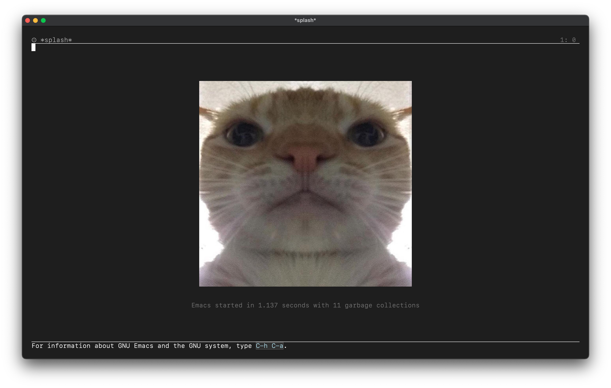

# my emacs configuration

this repository contains my simple emacs config.

this config is based on rougier's [elegant-emacs](https://github.com/rougier/elegant-emacs) and [rayes0's configuration](https://github.com/rayes0/emacs).

## install
install to your `.emacs.d` by using `git clone`

## screenshots

